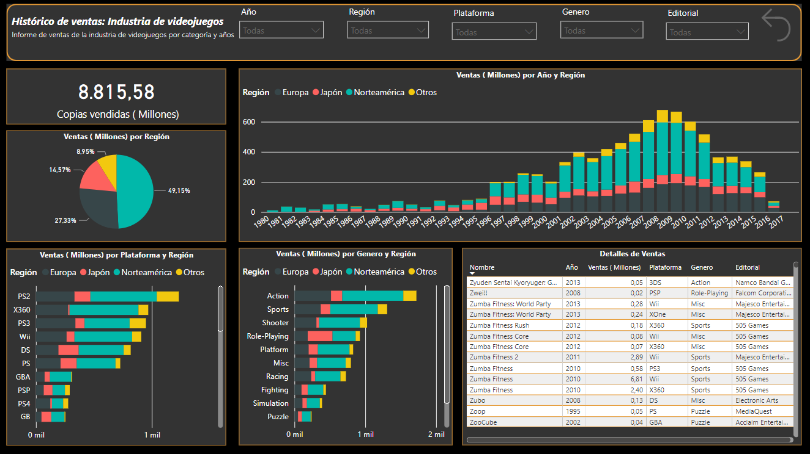
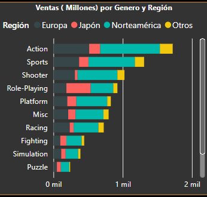
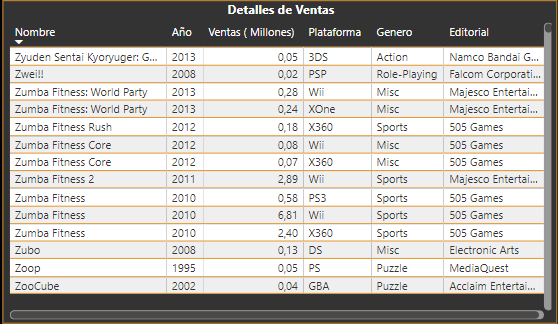
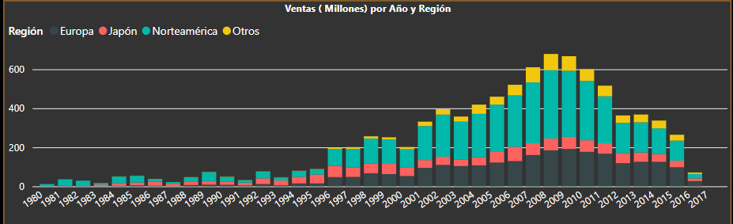
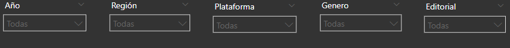

# 🎮  Tras los Controles: Un Viaje a Través de las Ventas de Videojuegos con Power BI 📊

#### 👤 Autor: [Alex Marzá Manuel](https://github.com/AlexCapis)

## 📝 Descripción del Proyecto

¡Bienvenido a "Tras los Controles: Un Viaje a Través de las Ventas de Videojuegos con Power BI"! Este proyecto te invita a explorar un análisis exhaustivo de las ventas de videojuegos utilizando Power BI. A lo largo de este notebook, encontrarás transformaciones de datos, visualizaciones y segmentaciones que proporcionan una visión clara y detallada de las ventas de videojuegos.

## 🔍 Requisitos Previos

Antes de comenzar, asegúrate de tener Power BI instalado y el conjunto de datos "ventas_videojuegos.xlsx" disponible en la carpeta [data](https://github.com/AlexCapis/Ventas-PowerBI/tree/main/data) del repositorio.

## 📂 Estructura de Carpetas

Para facilitar la navegación, hemos organizado el repositorio de la siguiente manera:

- [data](https://github.com/AlexCapis/Ventas-PowerBI/tree/main/data): Contiene los archivos relacionados con los datos utilizados en el proyecto de Power BI.

    - `ventas_videojuegos.pbix`: El archivo de Power BI que contiene el proyecto con las visualizaciones y el análisis.
    - `ventas_videojuegos.xlsx`: El conjunto de datos original en formato Excel que se utiliza en el proyecto.

- [docs](https://github.com/AlexCapis/Ventas-PowerBI/tree/main/docs): Almacena documentos y recursos relacionados con la documentación del proyecto.

    - `images`: Una carpeta que almacena las imágenes y gráficos utilizados en el proyecto.
    - `fondo.json`: Un archivo JSON que esta relacionado con la configuración de visualización.

- [notebooks](https://github.com/AlexCapis/Ventas-PowerBI/tree/main/notebooks): Contiene archivos de cuadernos Jupyter relacionados con el proyecto de Power BI.

    - `explicacion_powerbi_ventas.ipynb`: Un cuaderno que incluye una explicación detallada del proyecto.

- `.gitignore`: Un archivo que especifica qué archivos o carpetas deben ser ignorados por Git al realizar seguimiento de cambios.

## 📹 Demostración en Video

Antes de sumergirse en los detalles, te invitamos a ver una demostración en video que te guiará a través de las funcionalidades clave de este proyecto en Power BI. Haz clic en la imagen a continuación para ver el video:

## 📊 Configuración de los Datos

Para comenzar, realizamos transformaciones en el conjunto de datos a través del editor de Power Query para obtener las siguientes columnas:

- Nombre
- Plataforma
- Año
- Género
- Editorial
- Región
- Ventas (en millones).

## 📈 Visualizaciones Destacadas

### 1. Total de Copias Vendidas

Mostrar

### 2. Gráfico Circular de Ventas por Región

Mostrar

### 3. Gráfico de Barras Apiladas por Plataforma y Región

Mostrar

### 4. Gráfico de Barras Apiladas por Género y Región

Mostrar

### 5. Tabla de Datos

Mostrar

### 6. Gráfico de Columnas Apiladas por Año y Región

Mostrar

## 🎯 Segmentación de Datos

Para facilitar la exploración de datos, hemos creado segmentaciones por las siguientes categorías:

- Segmentación por Año
- Segmentación por Región
- Segmentación por Plataforma
- Segmentación por Género
- Segmentación por Editorial

Mostrar

## 📢 Conclusiones

En este proyecto, se han extraído valiosas conclusiones sobre las ventas de videojuegos, incluyendo la distribución global de ventas, las tendencias a lo largo del tiempo y las preferencias de género en diferentes regiones. Estas conclusiones tienen el potencial de guiar decisiones estratégicas en la industria de los videojuegos.

¡Disfruta explorando los datos y saca el máximo provecho de este análisis en Power BI!

